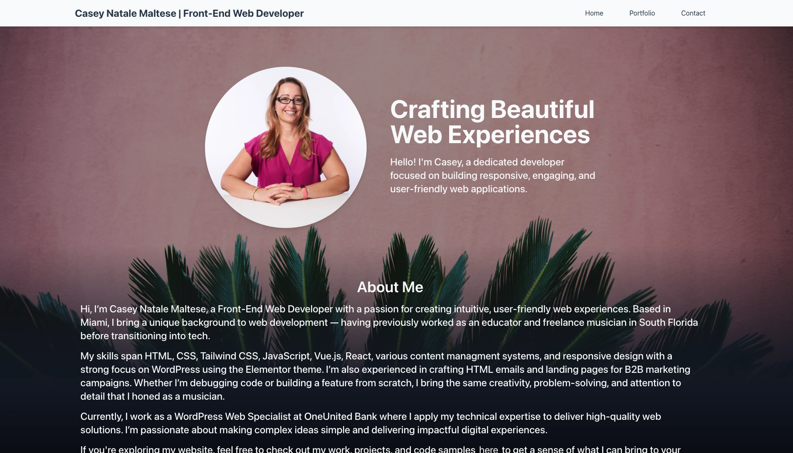
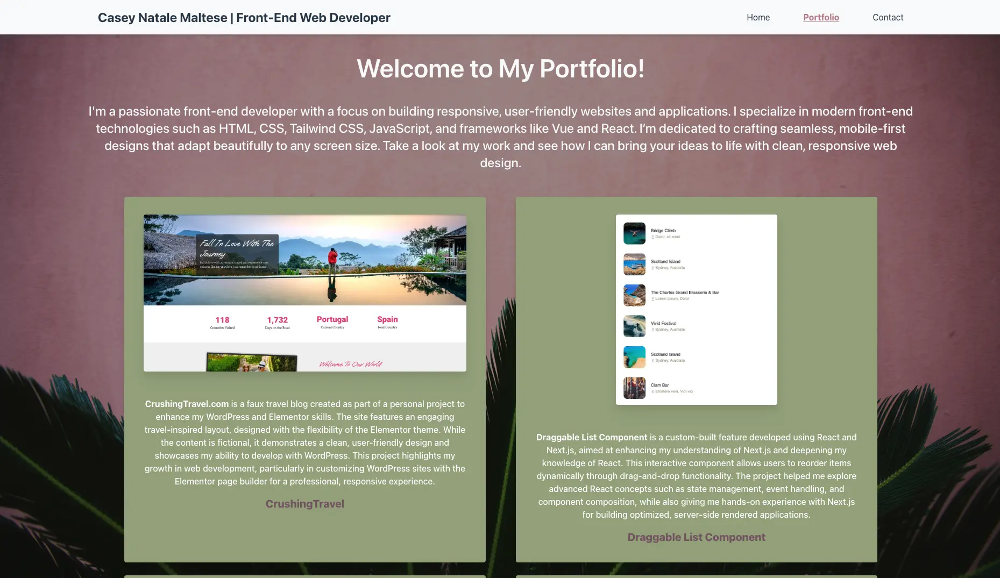
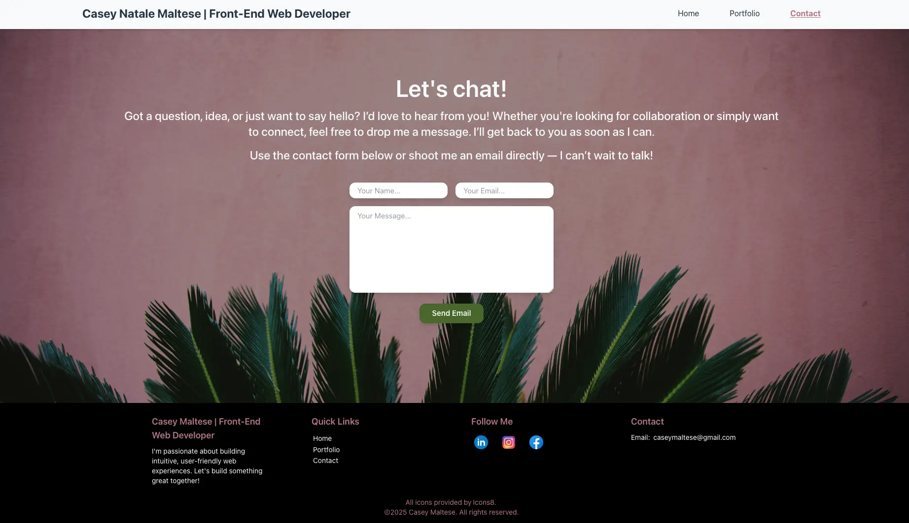

# Developer Portfolio Website

Welcome to my Developer Portfolio! This repository contains the code for my personal portfolio website where you can learn more about me, view my featured projects, and get in touch through a contact form.

## Features

* Home Page: A brief introduction to who I am, including an about section that highlights my skills and experience.
* Portfolio Page: A showcase of my featured projects, with links and descriptions.
* Contact Page: A form for visitors to reach out to me, powered by EmailJS to send messages directly to my email.

## Tech Stack

* Vue 3: The core framework for building the user interface.
* Vue Router: For smooth navigation between pages (Home, Portfolio, Contact).
* Tailwind CSS: For utility-first styling, ensuring the website is both responsive and visually appealing.
* EmailJS: To handle the submission of messages from the contact form and send them directly to my email.

### Prerequisites

* Node.js and npm installed on your machine.

### Installation 

1. Clone the repository: 
    git clone https://github.com/caseofbase18/vue-portfolio.git
2. Navigate into the project directory.
    cd vue-bio
3. Install dependencies.
    npm install
4. Set up EmailJS:
    * Sign up or log in to EmailJS.
    * Create an EmailJS service and use the provided service ID, template ID, and user ID.
    * Replace the placeholders in the project with your EmailJS credentials:
        * In src/pages/Contact.vue, update the EmailJS configuration.

## Usage

To start the app locally:
    npm run dev

This will start the development server on http://localhost:5173

## Key Components
* Vue Router handles routing between the Home, Portfolio, and Contact pages.
* Tailwind CSS provides a mobile-first, responsive design that adjusts to various screen sizes.
* The Contact Form uses EmailJS to send an email with the message content. Be sure to replace the default email configuration in ContactForm.vue with your own EmailJS credentials.
* The website is fully responsive, ensuring a great user experience on both desktop and mobile devices.

## Screenshots

### Home Page


### Portfolio Page


### Contact Page 


```
